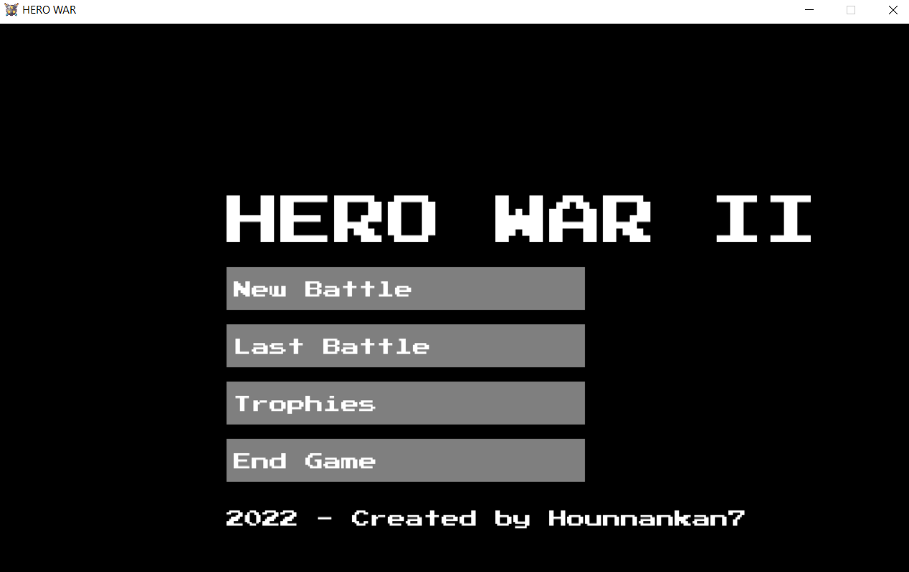
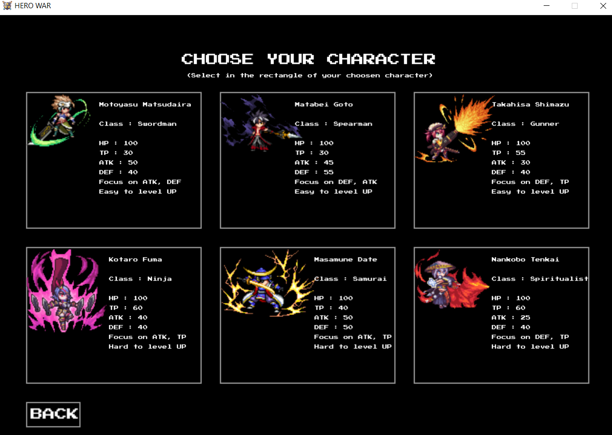
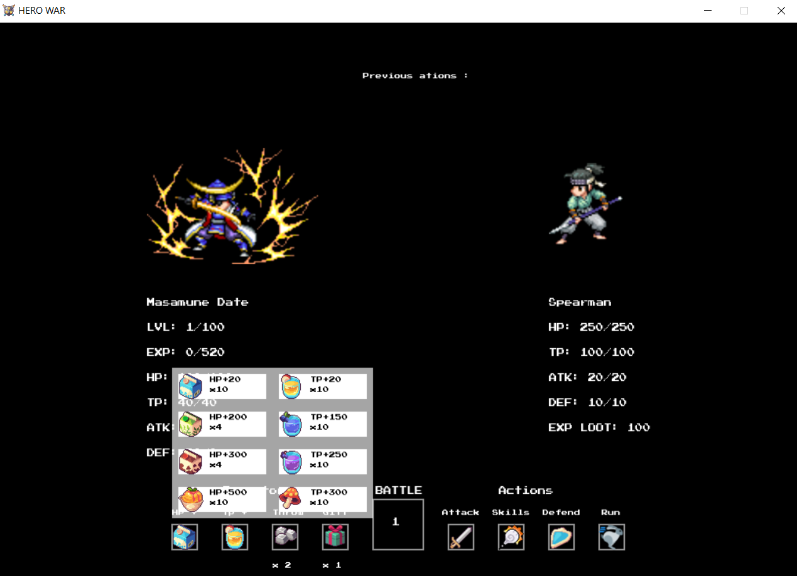
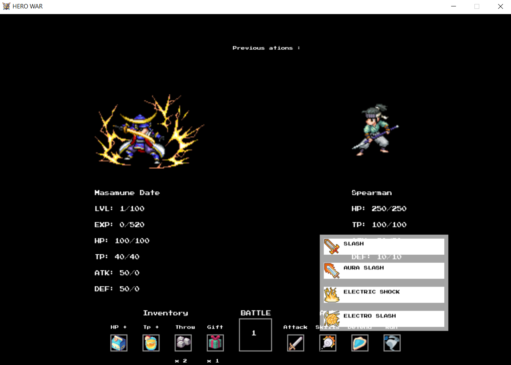
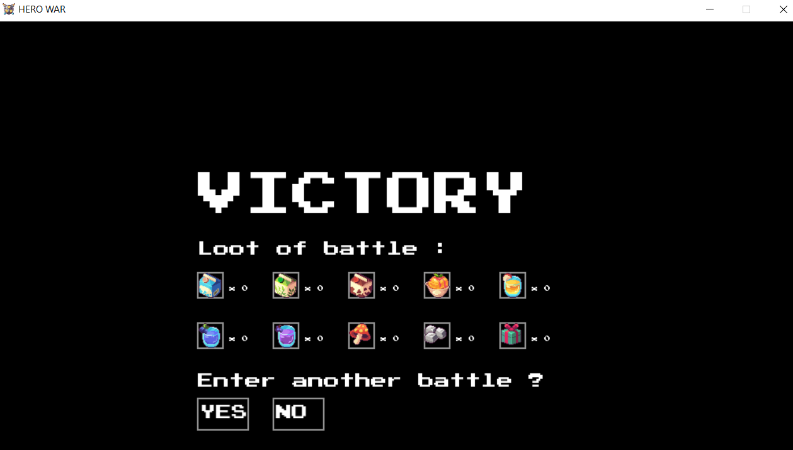
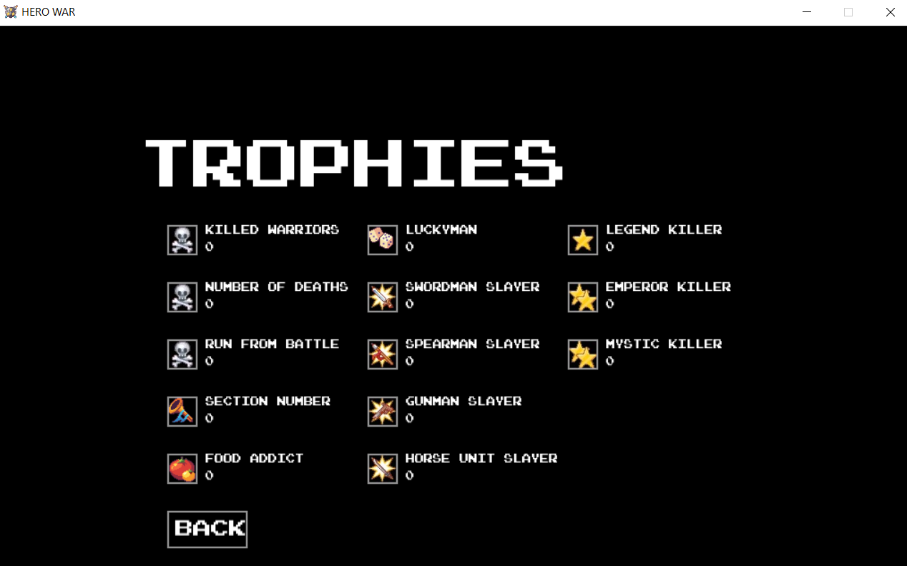

# To try the game
To play the prototype you just need to download the HeroWar.zip file, extract the content and run the .exe file in it.

# Hero-War-II
Prototype of a click based fighting game between heroes from legend, and developped in Lua and LOVE 2D framework for a bigger project.

# Systèmes Implémentés

+ Un menu principal d'ou commence toute la partie :

+ Choississez parmi six héros principaux :

+ Un système de combat au tour par tour, à l'infini jusqu'à la défaite du joueur avec un sytème de level Up pour le joueur, un inventaire et un menu skill :

# Systèmes à Implémentés

+ Un système de loot en cas de victoire :

+ Une liste fixe de badge à débloquer :

